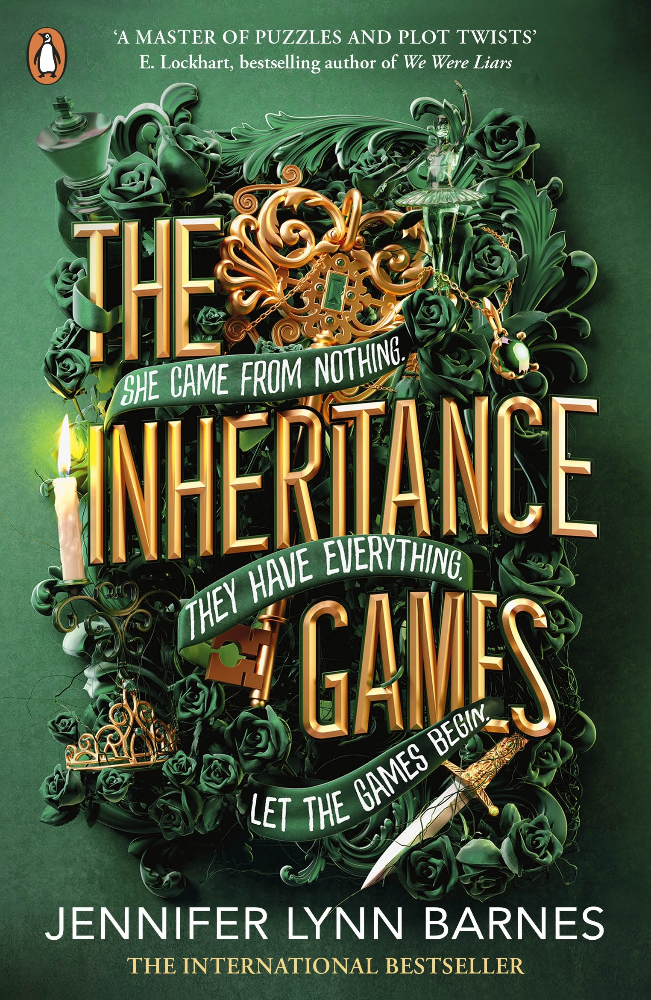

# The Inheritance Games

This recap is intended as a memory refresher for readers who have already read the book and want a quick reminder before continuing the series. It is not a substitute for the original work. 
All characters, settings, and storylines belong to their respective authors and publishers. If you have not read the book, I strongly recommend experiencing the original story first. No summary can replicate the depth, suspense, and enjoyment of reading the book itself.

## What Happens in the Book (10 Minutes)

The Inheritance Games revolves around Avery Kylie Grambs who inherits Tobias Hawthorne's billion-dollar fortune after he dies, despite having four grandsons and 2 daughters, Avery inherit it. Nobody knows why. The only condition laid out by Tobias for the money to go to Avery is that she must live in the house with the other Hawthrones for one year. 

Jameson is certain this is a puzzle laid out by his grandfather and convinces Avery to work with him towards finding out why Avery. When working together, Avery starts having feelings for him and they eventually kiss. As she continues to live in the house and work with Jameson she notices constant tension between Grayson and Jameson. 

While getting accustomed to the new life and figuring out the puzzle, Avery was the target for the Hawthornes because if she died, people thought that the money would go to the Hawthornes but in reality it would go to Libby or her absent father. When Avery was shot at and almost killed twice, she suspected it to be a Hawthorne and found out that it was Skye Hawthorne’s plan to get Drake to attack and kill Avery.

Whenever Drake would abuse Libby initially, Avery would insist Libby to leave him and Skye made him believe that he would benefit if Avery were dead and since Drake did not particularly like Avery either, he agreed to work with Skye.

After finding out about Skye's murder attempts, Grayson asks her to move out. This is a significant scene because this is where Grayson chooses Avery over his own mother.

Throughout the book she is constantly warned to be away from the Hawthornes by different people like Thea, who tells her that the last girl who was associated with the Hawthornes, was Emily who died last year. Nash, Skye and Grayson, themselves had been subtly warning her not to get attached to Jameson because he only looks at her as a mystery to be solved and not a *person*, that he did not really care about her except for the game.

Avery eventually gets skeptical about working with Jameson so she decides to ask him if he only looks at her for the game. To this, he says 'everything is a game'. This is when she realises that everyone was right, she builds a wall between the two of them and she becomes close to Grayson. 

As the story continues Avery finds out that both Grayson and Jameson loved Emily and that she was the granddaughter of the Laughlins who are trusted workers of the Hawthornes. While Emily was alive she wanted Jameson as well as Grayson and turned it into a game, since the Hawthornes *love* to win They both played. On the day she died Jameson had broken up with her because Rebecca, Emily’s elder sister had shown him a recording of Emily talking about what the boys did for her, to her and with her because she liked to keep score. 

The reason Rebecca had done this was because Emily wanted Thea to date Xander. Everyone around Emily used to keep her happy because of her weak heart before she got the transplant and that is why Thea and Xander decided to fake date whilst in reality Rebecca was secretly dating Thea and they were deeply in love. 

When Emily found out about this, she took it as a betrayal and wanted to prove to Rebecca that when the time would come, she would choose Emily over her. So to prove this Emily asked Thea to lie to the Laughlins and tell them that she was with Thea when in reality she was going cliff diving which was extremely dangerous. Despite Rebecca begging Thea not to do it, Thea still lied, choosing Emily over Rebecca and leaving Rebecca heartbroken. So as revenge she showed Jameson the recordings.

Rebecca knew from the beginning that Skye was the one who tried to get Avery killed but did not reveal this to anyone because she blamed herself for Emily’s death and knew Emily wouldn't have liked Avery. She feels guilty so eventually tells Avery that it was Skye who had planned the murder attempts.

After being dumped by Jameson, Emily called Grayson and asked him to take her cliff diving as a celebration. She jumped off a cliff and died after that because of her heart problems. Jameson had followed Grayson and Emily to the cliff and saw Emily dying there but did not do anything about it because he thought that she was putting up an act for attention.

Emily died on the same date as Avery’s birthday a year before Tobias died and the last clue to this puzzle was this date. Jameson and Grayson both thought the old man was trying to punish them by reminding them of their mistakes for choosing Emily over family. However, Xander explains later that the Tobias never wanted to punish them but wanted to see them reconcile which is why he had asked Xander to make sure they worked together. 

After the puzzle was solved, everyone was given the true message from their grandfather in their envelope and it is revealed that Xander was given a different task that he would find written in his envelop. Xander’s challenge was to find Tobias Hawthorne II. The man who was considered dead by his entire family for 20 years. 

Then it is also revealed that Harry, the old homeless man Avery used to play chess with at the park and fund his dinner occasionally was in fact Toby Hawthorne. 

Grayson also makes it clear to Avery that nothing can happen between the two of them despite the feelings because of how Jameson also feels for her and Grayson does not want to make the same mistake he did with Emily.

Avery also finds a hidden compartment in Tobias’ room with a bunch of pictures taken of her ever since she was six years old which tells us that Tobias had kept track of her since a long time. This makes it clear that she was not chosen simply because her birthdate was the same  Emily's death anniversary. The reason remains unclear still but this confirms that Avery was not a random girl he just chose.
Max is Avery's long distance best friend that goes through alot ever since Avery inherited the fortune because of the papparazzi. So at the end of the book to thank her Avery also funds for a trip to Australia for Max and her entire family. 
## **Characters & Relationships**

### Avery

She initially in the book is struggling because of financial problems and is therefore juggling school alongside a job. She is studying in high school working towards earning a scholarship for a good college. She as a child used to play all sorts of games with her mom. She has feelings for both Jameson and Grayson just like Emily did, therefore she is compared to Emily multiple times. Both the boys feel for her too

### Libby and Nash

She is Avery’s stepsister. They have the same father. After Avery’s mother passed away, Libby took her in and became her guardian. Even after inheriting the estate Libby is living with Avery in the Hawthorne House. She is described as someone who is a ray of sunshine and cannot say no to people. Libby is noticed to be spending a lot of time with Nash Hawthorne towards the end of the book. Nash is the oldest Hawthorne brother. He is described as someone always ready to help someone. Most of the servants in the house are Nash’s because he wanted to help them. One such servant is Millie. 

### Grayson and Jameson

Grayson was expected to be the inheritor of Tobias’ fortune and The Hawthorne Foundation because he had worked towards the foundation since he was a child. He was therefore bitter towards Avery initially. He started putting his family before all after Emily’s death because Tobias told him that none of this would have happened if he would have chosen his brother, Jameson. Jameson a sensation seeker with hunger to find something ever since he was born. Someone who is always down to solve a riddle. Both Jameson and Grayson have ultimately developed feelings for Avery and both blame themselves for Emily’s death.

### Thea and Rebecca

Rebecca’s life used to revolve around Emily because their parents told Rebecca to do whatever made Emily happy because of her heart condition. She never really wanted anything for herself except when Thea came along, she fell in love with her. Thea goes to the same school as the Hawthornes and Avery. She blames the Hawthornes for Emily’s death and goes to great lengths to remind them of what they did. She made Avery dress up the same way Emily did, only to instigate the brothers. Thea and Rebecca like each other.

## Oren and Alisa 
Oren is the head of Security who is supposed to ensure Avery's safety after coming into the spotlight. Alisa is Avery's lawyer, she is also Nash Hawthorne's ex-girlfriend, she is taking care of all the legalities for smooth transfer of Tobias' empire to Avery and make the transition easy for Avery too.

## **Things That May Matter for The Hawthorne Legacy**

- The biggest unanswered question remains: Why did Tobias Hawthorne leave his fortune to Avery, a girl who appeared to have no connection to the family?
- Avery has dreams and remembers playing ‘I have a secret’ with her mother where her mom says that she has a secret about the day Avery was born but never got to telling her that. We do not even find out about the secret in the first book.
- The main cliffhanger the book left us on is that Toby Hawthorne who was said to be dead for more twenty years, the son of Tobias Hawthorne is none other than the Harry in the park that Avery used to play chess with.
- Xander is also given an individual puzzle by Tobias Hawthorne which is to find Toby Hawthorne.
- The fact that Tobias Hawthorne kept pictures taken of Avery throughout her life tels us that maybe she was not chosen just as a matter of chance because her name jumbled gives us 'A Very Risky Game' and because her birthdate matches Rebecca's death anniversary. Maybe she was chosen for another reason.
- Xander may have a crush on Rebecca with the way he talks about her in the last chapter and mentions that he wanted Rebecca there but could not be alone with her.
