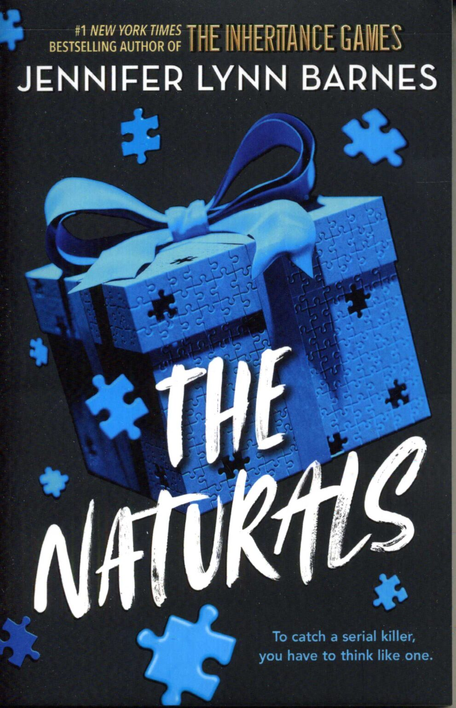

# The Naturals

This recap is intended as a memory refresher for readers who have already read the book and want a quick reminder before continuing the series. It is not a substitute for the original work. All characters, settings, and storylines belong to their respective authors and publishers. If you have not read the book, I strongly recommend experiencing the original story first. No summary can replicate the depth, suspense, and enjoyment of reading the book itself.

## What happens in the book (5-7 minutes)

Casandra is approached by Micheal at the restaurant she works at as a waitress. She then meets Officer Briggs who tells her that there is a secret program of the FBI called Naturals where people who have special skills are being a part of this in order to solve all the cold cases of serial killers by looking at the recordings and reading the files of the cases and they would want her to join the program as a Profiler because of her exceptional skills to read people with accuracy. 

She agrees and is introduced to other members of the program, all below the age to eighteen. Micheal is the first one she meets, he is very good at reading emotions off of people just by looking at them, Lia who can spot a lie from a mile away, Sloane who is unrealistically good at knowing the statistics of everything and finally Dean, another profiler just like Cassie.

Once she is a part of the program, she starts training along with Dean and Agent Locke, a senior profiler. She learns that you are supposed to call the killer UNSUB- Unknown Subject, officially while studying the case when you are unaware of the killer’s identity. Different terms like the killer’s MO that is mode of operation referring to the weapon used and the location, it includes things that are needed to be done to kill someone and Signature which refers to things they do after the murder like take a piece of belonging from them for memory's sake or leave an origami piece behind next to the body. The MO can change but the Signature cannot. Finally, Victimology that is study of the victims to understand the killer’s motives and psychological needs. 

While familiarising herself with everyone at the program she starts having feelings for Micheal and Dean. Both of them clearly feel for her too. She ends up kissing Dean during truth and dare because of a dare given to her by Lia. Micheal hates this and kisses her that night alone, at the pool. She is confused throughout the book about who to pick between the two of them. She also finds out that Lia and Micheal used to make out before she became a part of the program. Cassie also kisses Micheal again later in the book while solving the case during a very vulnerable phase but nothing more ends up happening because they are interrupted by Dean. 
She also finds out that Dean's father was a serial killer and Dean became a part of the FBI ever since his father was caight. His talent was seen by Ageny Briggs and so he was the first member of the program ever since he was a child

While her training she finds out that Locke and Briggs are working on an active case and about a serial killer. When she sees the files of the murders, she realises these murders are related to her mother, Lorelai’s murder because all the victims have the exact same traits as her mother. She initially thinks it is the same murder but on digging further she realises that it is someone who has not actually killed Lorelai but wanted to. The UNSUB is trying to get to Cassie by creating the same scene as Lorelai’s murder, the UNSUB also sends Cassie gifts which have the victim’s hair or picture. As she convinces Briggs to allow her to work on the case as it is related to her, with time she realises that the UNSUB is an insider who works at the FBI and knows about the Naturals. 

When she calls Agent Locke to tell her all of this, she tells Cassie to come to a security house with Dean and make sure that no one sees so she is safe there. On arriving there, Locke is standing with a gun and she shoots Micheal multiple times when she sees that he has followed Cassie and Dean to the security house. Just as Dean is about to shoot Locke, she says that he is a murderer at heart like his dad and when she finds the opportunity she hits Dean who then becomes unconscious.

That is when it is revealed that Locke is actually Cassie’s aunt and that she and Lorelai had an aggressive and abusive father. When Lorelai was pregnant with Cassie, she decided to leave Locke behind with their father when initially they had always faced him alone. Lorelai being the elder sister had taken charge and protected Locke but then she just left one day and refused to take Locke with her. Out of sheer anger and frustration, when Locke got out of the house she started looking for Lorelai and Cassie to kill them but before she could find them Lorelai was already murdered. So, she started killing people who looked exactly like Lorelai to feel the pleasure of killing her. 

Then she changed her name from Lacey to Locke and became a part of the FBI to find out who murdered Lorelai, not to punish them for murdering her but for murdering her before Lacey could. Once she was a part of the Naturals and was training Cassie, she saw the similarities between the two of them. That is when she thought that maybe they could work together. So she brought Heather a teenager she had held captive and asked Cassie to kill her right there. 

When Cassie could not do that, Locke was all ready to kill her but just before she was able to attack her, Micheal picked up the gun and shot Lacey and killed her.

## Characters and their Relationships (2 Minutes)

### Cassie

Ever since she has become a part of The Naturals, she feels weirdly at home. Getting into serial killers’ minds which might seem disturbing for most people out there, Cassie as a matter of fact enjoys it. When she starts reading files she cannot stop because she genuinely enjoys using her ability to the fullest. 

### Micheal

He is in charge of reading emotions off of people’s faces. He can very easily hide his emotions himself which makes it very hard for Cassie to read him despite being a profiler. He has feelings for Cassie and has always very evidently approached her. It is no secret that he feels for her.

### Dean

Dean is also a profiler who is working with Cassie. He finds it extremely easy to get into killers’ minds and thinks it is because his father was a serial killer. He believes somewhere that he is not a good person and might have the same killer instincts similar to his dad did that is why at the security house when Locke says that Dean is just like his dad, a killer at heart, he freezes because he is a very good human being but is scared that maybe he might just turn out like his dad. 

Because of this fear he always draws a wall between him and Cassie despite having feelings for Cassie and does not act on it as openly as Micheal does because he also thinks that Micheal can treat Cassie better than Dean can and that h is also not inherently linked to a serial killer. 

### Sloane and Lia

Sloane is an awkward character who is very smart and knows the statistics better than she knows the back of her hand. She is a very sweet person and tries to console Cassie throughout the book. She is Cassie’s roommate too. 

Lia is exceptionally good at catching lies. Herself an amazing liar. She is also the kind of person who always knows what is happening with everyone who is a part of the program,. She eavesdrops and everyone knows it. If they want to do something without anyone finding out they just need to ensure that Lia is not around.

### Agent Briggs

He is leading the program. The higher up of the FBIs are skeptical of the program since everyone are not even adults. He is very reluctant on having Cassie and the others work the active case during this book because he does not want to put any of their safety in jeopardy. 

## Things That May Matter in the Next Book (1 Minute)

- We still don’t know who killed Cassie’s mother.
- Cassie has still not made a decision about whether she likes Micheal or Dean and who she would actually want to choose.
- By the end of the book, Dean is blaming himself for not pulling the trigger and killing Locke to save Cassie. Micheal was heavily injured because of the multiple gunshots fired by Locke.
