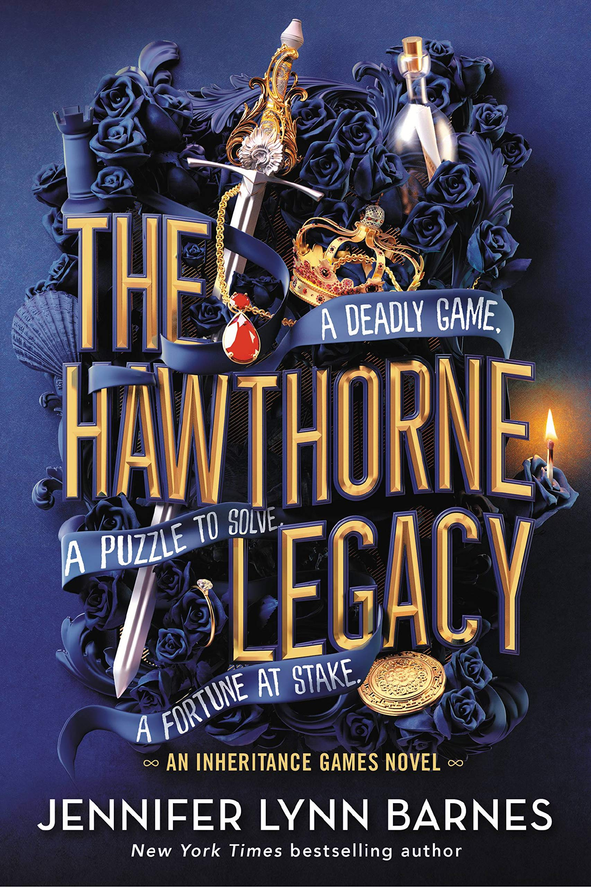

# The Hawthorne Legacy

This recap is intended as a memory refresher for readers who have already read the book and want a quick reminder before continuing the series. It is not a substitute for the original work. All characters, settings, and storylines belong to their respective authors and publishers. If you have not read the book, I strongly recommend experiencing the original story first. No summary can replicate the depth, suspense, and enjoyment of reading the book itself.

## ‘The Inheritance Games’ Ending

At the end of The Inheritance Games, Avery feels like Jameson still only views as a part of the puzzle, Grayson has told her that he will ensure her safety but will also maintain distance because Jameson likes Avery and he does not want to repeat the same mistakes he made with Emily.

Toby Hawthorne, Tobias’s son was considered dead for 20 years but is still alive and was calling himself ‘Harry’ to Avery and used to play chess with her at the park because he was homeless. Avery has found a picture of Toby in Nan’s room and has figured out all of this, simultaneously Xander’s letter from Tobias mentions him to find Toby Hawthorne. 

Max and Avery’s friendship is stronger than ever, Rebecca and Thea still like eacj other but Rebecca continues to feel betrayed because of how Thea chose Emily despite Rebecca’s pleas and Libby and Nash are becoming really comfortable and close

## What Happens in the Book (10 Minutes)

Grayson is extremely against Avery trying to find Toby because if Toby is alive that means that maybe a loophole can be found in the will and he does not want anything to happen to Avery. Against his warnings she, Jameson and Xander, all of them start solving the mystery and work together as a team. Zara also helps a little in the end because she really misses Toby as well.

Max moves in at the Hawthorne House after her parents ‘disown’ her and they have a huge argument, her mom and her do reconcile in the end but throughout this book Max is living with Avery and is thus also a part of the mystery solving, she becomes close to Xander while her stay there. 

During all of this Avery finds out that Skye has been sleeping with Ricky, Avery’s father who was deadbolt and that they have a plan for making Ricky Avery’s legal guardian again, thus taking the money from Avery. 

Avery knows that Toby died on the Hawthrone Island, along with two other reputed boys who came from respected families and one other girl, Kaylie Rooney, who was held responsible for the fire because of her background in juvenile for arson, she is later revealed to be Avery’s mother’s sister, i.e. her aunt.

One of the boys’ who died there was Colin Wright and while watching a video of his funeral Avery noticed that his uncle’s name is Sheffield Grayson and realised he is Grayson’s father. On talking to him it becomes clear that the fire on Hawthorne Island was set by Toby but this never got out because Tobias has paid the police off. Sheffield also makes it clear that he wants nothing to do with Grayson whatsoever.

Toby was actually the Laughlins’ first child who they were forced to put up for adoption. They were unaware until very later on that the people who adopted Toby were in fact the Hawthornes, so technically Toby is Rebecca’s brother. For most part of the book Avery starts to believe that Toby is her father because he entered her life right after her mother died and Toby was adopted so it made sense that her and the Hawthorne’s’ DNA did not match. This would also explain why Tobias would leave his billion-dollar fortune to Avery. 

Toby lost his memory right after the fire and was saved by Jackson, a man on the boat the night of the fire. Jackson along with Hannah, Avery’s mother looked after Toby for a month and in this time he and Hannah fell in love. That’s when he realised that he was responsible for Hannah’s sister death but Hannah didn’t let him surrender himself to the police because she knew her parents were dangerous and would kill him for murdering their daughter Kaylie. Hannah also loved him too much. 

Toby felt extremely guilty and knew that if he went back to his house Tobias would cover for him but he thought that he did not deserve that. He also knew that Tobias was extremely capable of finding him, so he decided to leave Hannah and Jackson and run away in the middle of the night. 

Finding all of this out was extremely shocking for Avery because her mother had always told her that she did not have any family, and Avery had never asked a lot of questions either. But now it was clear that her mother’s real name was Hannah and not Sarah, she changed her name to run away from her family. Avery even calls Hannah’s mother but she just warns Avery and tells her not to call her back and that she wants nothing to do with her or her money. 

A bomb is planted in Avery’s aircraft that nearly kills her and Oren thinks that it is Skye who was behind it so she is sent to prison along with Ricky, even when it is clear that the person responsible for it was Sheffield, Oren thinks it best to keep Skye is prison because she is a threat and did try to kill Avery initially in the first book.

Towards the end, Avery is kidnapped by Sheffield Grayson and he says that the bomb that was planted in her plane was planted by him to hurt Avery because he was trying to lure Toby out of hiding and kill him. He still holds Toby accountable for Colin’s death and did this for vengeance. When Toby shows up and Sheffield was about to kill Avery and Toby, Millie pulled the trigger on him and killed him instead. 

This is when it is revealed that Ricky is biologically Avery’s father and that the secret her mother kept talking about was that Toby was the one who had delivered Avery and chosen that name for her. He had signed Avery’s birth certificate with Ricky’s name because Ricky wasn’t there. But he is actually Millie’s sister’s biological father. 

Avery was under the impression that Millie was working with Sheffield and helped in kidnapping her for the money but the real reason was because Millie’s sister, Eve is actually Toby’s daughter from a one-night stand and Toby doesn't even know it. So, for her sister she wanted to find Toby because Eve is also a Hawthorne and deserves to be treated like one.

Eli who was Avery’s private bodyguard is Millie’s brother and was fired for leaking information about Toby being alive to the press which made everything go into chaos for Avery because people thought that if Toby is alive then the fortune might go to him and be taken away from Avery. He also did it to lure Toby and not for the money but was misunderstood.

After everything is much clearer and Avery is safe and sound back home, she thinks that Tobias did not choose her simply because her name is an anagram for ‘A Very Risky Gamble’ but because her name was decided by Toby and Tobias figured that. Maybe Tobias also looked at Avery as a means to an end and tried to use her just like Sheffield and Millie did. To lure Toby out of hiding because Tobias was unable to do that himself when he was alive. But this does not affect Avery because she is done being used and is going to take control of situations moving forward. 

During the puzzle solving like everyone found out about Grayson’s father, they also found out that Jake Nash is Nash’s dad.  Zara liked him back when she was young and despite knowing that Skye slept with Jake and had Nash. This had also created a rift between the sisters. 

Avery also finds Xander, right at the end, working on finding the identity of his own father. Xander believes that Tobias knew that he was the kind to get diverted from the main motive of a mystery he was solving and get diverted to another route and he thinks that Tobias all along planned to have Xander find the identity of the fathers of the Hawthorne brothers. 

## Characters and Relationships

### Avery and Jameson

By the end, Avery has a shift in her mindset regarding a lot of things. She is not affected if Tobias did choose her only to use her and try to lure Toby in, she has decided that she will no longer want to sit and be used and will make decisions and take control of the situation.

Throughout the book when Avery is in danger during multiple situations, a different side of Jameson has been noticed which tells us that he no longer views Avery as a mystery but along the way has genuinely started caring for her. He tells her this openly Avery feels the same way about Jameson. Initially they kissed but they had mutually agreed that it did not mean anything more but that has changed and they both have confessed that they do feel more.

### Grayson

Grayson has from the beginning stuck with the fact that he will keep Avery safe and looks at her as one of them. Grayson kisses Avery during an interview because he wanted to stop her from saying something wrong which she was about to. After instances like these Grayson takes the extra effort to maintain distance with Avery because it is clear that he does not want to cross any boundaries and is afraid that he might because of just how much he likes her. He does not want to come between Jameson and her. 

### Max and Xander

While Max’s stay there she is a big help for Avery emotionally, she keeps trying to remind Aver that if she wants something she should go for it and not think about it as much as she does. The shift in Avery’s mindset is partially because of Max’s pep talks throughout the book. When Avery is injured because of the bomb and is in a coma, Max calls her mother who is a doctor to come to the Hawthorne House and treat Avery. This is when they reconcile in the end. 

Xander and Max become pretty close to each other. Xander also involves Rebecca and Thea while solving the puzzle 

### Thea and Rebecca

Thea is in love with Rebecca and by the looks of it, Rebecca feels the same way but she still does not trust Thea after what she did in the previous book by choosing Emily over her. Thea has apologised multiple times but Rebecca still does not trust her, she was extremely hurt. 

Rebecca is also going through a lot because ever since her mother lost Emily, she has been going through a lot. She looks directly into Rebecca’s eyes and cries about how all of her children have died. She has also had multiple miscarriages before but all of this is coming out on Rebecca and she is going through a lot. It is almost as if her mother neglects her even after Emily is gone.

### Libby

In this book also Libby and Nash are very close and spend a lot of time together. Libby is Avery’s guardian but Avery asks Libby to legally step down from that responsibility because that way Avery can write her own will about who the money goes to when she dies after she inherits the fortune. Libby feels hurt when she is asked to do that. She truly cares for Avery as a sister. When Avery believed that Toby was her father, it also meant that Libby was not Avery’s sister and that was an upsetting thought for her. 

### Zara and Oren

Zara loves her nephews dearly and that becomes especially clear in this book. She feels like she was never good enough for Tobias and no matter what she did she would never be noticed by Tobias like the others were. She and Oren were intimately involved briefly before Avery came into the House.

## **Things That May Matter for The Final Gambit**

- Avery finds letters that were shared between her mother and Toby in which Tobys advises her to go to Jackson and take the disk from him because she knows what i is worth but in the end when Avery tries to stop him from leaving and asks what the disk is, he takes it and doesn’t tell her anything.
