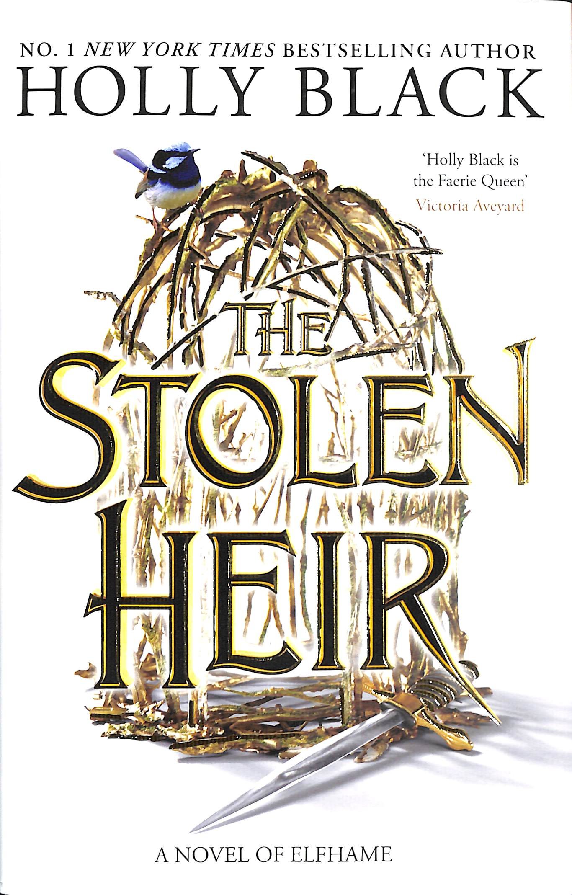

# The Stolen Heir
This recap is intended as a memory refresher for readers who have already read the book and want a quick reminder before continuing the series. It is not a substitute for the original work.
All characters, settings, and storylines belong to their respective authors and publishers. If you have not read the book, I strongly recommend experiencing the original story first. No summary can replicate the depth, suspense, and enjoyment of reading the book itself.

## What happens in the book (10 minutes)

Wren moves to the mortal world after Jude freed her from the bridle at the end of ‘The Queen of Nothing’ and practices breaking curses cast by the folk on the mortals because she knows how it feels like to be captured.

Oak and Tiernan and their prisoner Hyacinthe (half falcon) approach Wren for help to stop Lady Nore as she is building an army of all the faeries that were turned to falcons at the end of ‘The Queen of Nothing’ and she has Mab’s bones which have immense magical properties that can destroy Elfhame. Since Jude made Lady Nore vow to follow all of Wren’s commands, Oak believes Wren can help them stop her. 

They need to find Mellith’s heart before Lady Nore does because the heart will activate the power of Mab’s bones, without the heart, the bones are futile. Then they start heading towards the Ice Needle Citadel where Lady Nore resides. They need to find the Thistlewitch who can tell them exactly where Mellith’s heart is. To find her they go to the Court of Moths where Wren finds out that Lady Nore asked Oak to procure the heart for her in exchange for Madoc who is her prisoner at the moment. 

When they find the Thistlewitch, she tells Oak where Mellith’s heart is but when the others ask, Oak just dismisses the question and says it is somehwere safe and Lady Nore will not have it.

This is when she starts suspecting Oak and realises that he has not been telling her everything and fears being betrayed by him. Wren confronts Oak about her suspicions and her reassures her and tells her that he will only give Lady Nore a deer heart and trick her into the deal and no harm will reach any of them (Oak, Teirnan and Wren). 

They travel a long way to finally reach the Citadel and when they do, Teirnan stays outside while Oak and Wren go inside. When they are faced with Lady Nore she cuts Wren’s tongue to prevent her from commanding Lady Nore. After this Oak tells Lady Nore that he HAS Mellith’s heart which catches Wren by surprise and thinks she was kept in the dark about the true plan. She also overhears a conversation between Oak and Madoc and it sounds like that Oak will betray her.

Wren finds Mab’s bones and uses it to grow her tongue again. She then takes control of Lady Nore but not for too long because then Lady Nore hints this to Hurclaw, the Troll King who needs Mellth’s heart to free the trolls from the forest and break their curse. Hurclaw shoots Wren. 

That is when she realises that Bogdana, the storm hag who tortured her and was alway helping Lady Nore, is actually her mother and Wren’s heart is Mellith’s heart. She soon realises how powerful she truly is and kills Lady Nore, breaks the curse on the trolls and tells everyone to leave except Oak.

She feels betrayed by him because he knew all along where Mellith’s heart truly was but kept her in the dark. She is now in power of the Court of Teeth and enjoys the power more than she thought she would. Oak obviously has feelings for her throughout the book and had no ill intentions toward her whatsoever but Wren is not in a position to be able to see that at the moment. He seems to have truly planned everything out in a way so as to hurt no one except Lady Nore.

## Characters & Relationships

### Wren

Suren (Wren), daughter of Lord Jarel and Lady Nore was controlled by them using a magical bridle all her life. Until she was 7 she believed she was human living her true mortal family until her parents came and removed her glamour and revealed to her she was not human. She yearns to live with her human parents again who accept her no longer. 

Wren and Oak have feelings for each other throughout the book but at the end of the book Oak is her prisoner. She is the ruler of the Court of teeth

### Oak

Extremely secretive throughout the book, son of love talker so is a good manipulator. When he fights, he shows no mercy. He KILLS.

He is the heir to Elfhame, younger brother to Jude, The current Queen of Elfhame. 

### Bogdana

Mab was the first ruler of faerie and was granted immense amount of power by a hag, in return the hag asked Mab to make her daughter heir to the throne but Mab betrayed her and killed the daughter, Mellith instead. So the hag cursed her and said that if she did not have Mellith’s heart her powers would be useless. The hag is bogdana and therefore she is Wren’s mother.

### Teirnan

Teirnan and Hyacinthe definitely were romatically involved for some amount of time before Hyacinthe changed sides and decided to go against the throne of Elfhame. Teirnan is a trusted shadow by Jude who is personally close with Oak and his duty is to protect him at all times, he was appointed by Jude.

## Things That May Matter for The Prisoner's Throne

1. In the court of Moths, Hyacinthe was taken in prison and Wren went out of her way to help him escape. Not only did she release him but also a mortal girl and a spy of the undersea from the prison of the Moths’ court. 
2. While releasing Hyacinthe, Wren broke his curse and he was no longer a falcon. This made him swear loyalty to Wren. He then went to the Citadel and during the climax of the book helped Wren against Lady Nore.
3. There have been brief references dropped about the Queen of the Undersea struggling and the place being in absolute havoc.
4. Hyacinthe had tried to kill cardan at some point (nothing much is explained about this yet)
5. Even though Oak does not tell Wren when he finds out where Mellith’s heart is, he does ask her to leave then and not be a part of the plan anymore which tells us he really did want to look out for her and cares for her.
6. Wren has taken Oak as a prisoner in the end which means that there will be repercussions there since he is deeply loved by Jude and Cardan and Elfhame will not let their heir be a prisoner for too long.
